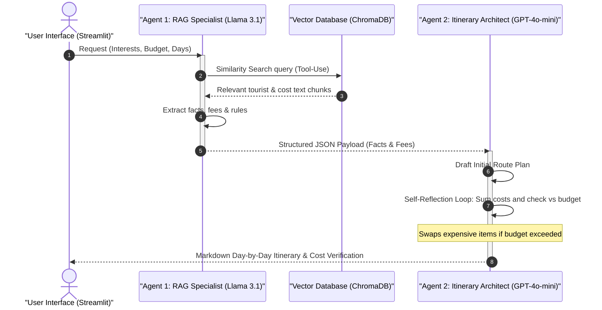

# 🇱🇰 Sri Lanka Tourist & Heritage Route Planner (Agentic AI)

An intelligent, multi-agent, RAG-driven travel planner application that designs custom daily travel itineraries across Sri Lanka based on user budget, trip duration, and preferences.

🌐 **Live Streamlit App:** [Deploy on Streamlit Community Cloud](https://share.streamlit.io/)

---

## 🏗️ Architecture & Agent Flow

The application uses a custom multi-agent orchestration pattern where agents exchange structured payloads to refine recommendations.



---

## 🤖 Model Selection Strategy Comparison

| Sub-task | Selected Model & Provider | Justification |
| :--- | :--- | :--- |
| **Intent Routing & Context Extraction** | `llama-3.1-8b-instant` (via Groq) | Extremely low latency, near-zero cost, highly efficient for parsing user queries and extracting facts/JSON structures. |
| **Itinerary Synthesis & Budget Check** | `gpt-4o-mini` (via OpenRouter) | High reasoning quality, reliable compliance with budget constraints and complex formatting, accessible on openrouter free tier. |

---

## 🛠️ Agentic Design Patterns Used

1. **Tool-Use Pattern:** Agent 1 queries the local Chroma vector database to fetch factual ticket fees, local transport rates, and rules from the knowledge base.
2. **Router Pattern:** Agent 1 parses selected user interest tags to create specialized search vectors.
3. **Reflection Pattern:** Agent 2 checks its own drafted schedule to ensure the total entrance fees and transport fit the user's budget ceiling. If they do not, it runs an adjusting loop to replace expensive items with affordable alternatives.

---

## 🧪 RAG Retrieval Quality Evaluation

The ingestion pipeline chunks 100 comprehensive domain documents (covering UNESCO heritage sites, accommodation tiers, adventure packages, tourist police & emergency hotlines, transport apps, Hela Bojun dining, botanical gardens, and forest/wildlife permits) using a `RecursiveCharacterTextSplitter` (600 characters size, 100 overlap) and caches vectors using open-source `sentence-transformers/all-MiniLM-L6-v2`.

| Sample Query | Retrieved Context Relevant? | Commentary |
| :--- | :--- | :--- |
| *What is the entrance fee for Sigiriya?* | ✅ Yes | Correctly fetched $35 USD (~11,300 LKR) from `doc_01_sigiriya.txt`. |
| *What is the Tourist Police hotline number?* | ✅ Yes | Retrieved 24/7 hotline 1912 & emergency 119 from `doc_56_tourist_police_hotlines.txt`. |
| *Where can I find budget hostels in Kandy & Colombo?* | ✅ Yes | Retrieved LKR 2,500-6,000 dorm options from `doc_31_budget_hostels_colombo_kandy.txt`. |
| *How much is white water rafting in Kitulgala?* | ✅ Yes | Extracted $35-$65 USD rafting package details from `doc_47_kitulgala_whitewater_rafting.txt`. |
| *What is Hela Bojun Hala and where are outlets located?* | ✅ Yes | Extracted female entrepreneur vegetarian outlets & menu items from `doc_66_hela_bojun_outlets.txt`. |

---

## ⚙️ Local Installation & Setup

1. **Clone the Repository:**
   ```bash
   git clone https://github.com/E-Dasun-Manjitha/sl-heritage-travel-planner.git
   cd sl-heritage-travel-planner
   ```

2. **Set up Virtual Environment:**
   ```bash
   python -m venv venv
   # Activate:
   venv\Scripts\activate # Windows
   source venv/bin/activate # Mac/Linux
   ```

3. **Install Requirements:**
   ```bash
   pip install -r requirements.txt
   ```

4. **Populate Database:**
   ```bash
   python generate_data.py
   python rag_builder.py
   ```

5. **Configure Secrets:**
   Create `.streamlit/secrets.toml`:
   ```toml
   GROQ_API_KEY = "your_actual_groq_api_key_here"
   OPENROUTER_API_KEY = "your_actual_openrouter_api_key_here"
   ```

6. **Run Streamlit app:**
   ```bash
   streamlit run app.py
   ```
