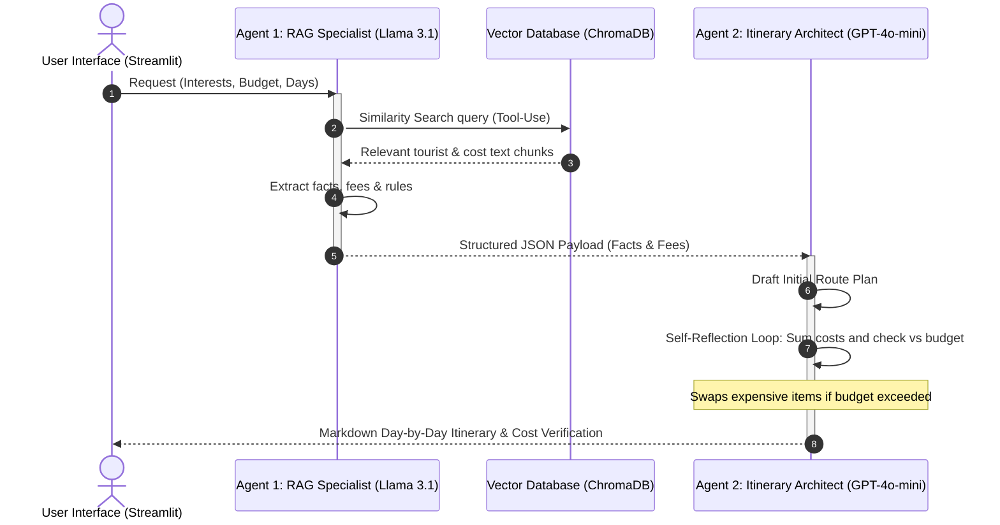

# Sri Lanka Tourist & Heritage Route Planner (Agentic AI)

An intelligent, multi-agent, Retrieval-Augmented Generation (RAG) travel planning application that designs custom daily travel itineraries across Sri Lanka based on user budget, trip duration, and preferences.

---

## Live Demonstration

The application is deployed and publicly accessible on Streamlit Community Cloud:

[Sri Lanka Tourist & Heritage Route Planner App](https://sl-heritage-travel-planner-ds9abxjmjwyckjsapeeaog.streamlit.app/)

---

## Architecture & Agent Communication

The application uses a custom multi-agent orchestration pattern where specialized agents exchange structured JSON payloads to formulate and refine travel recommendations.



---

## Agentic Design Patterns

1. **Tool-Use Pattern:**
   - **Where it lives:** `agents.py` inside `agent_1_logistics_specialist()`
   - **Implementation:** Queries the local Chroma vector database (`vector_db.similarity_search()`) to fetch factual entrance ticket fees, local transport rates, and rules from the domain knowledge base.

2. **Router Pattern:**
   - **Where it lives:** `agents.py` inside `agent_1_logistics_specialist()`
   - **Implementation:** Parses selected user interest tags, accommodation tier, and trip duration to dynamically construct specialized search vector queries.

3. **Reflection / Self-Critique Pattern:**
   - **Where it lives:** `agents.py` inside `agent_2_itinerary_architect()`
   - **Implementation:** Agent 2 calculates total entrance fees, transport, dining, and accommodation costs against the user's budget limit. If exceeded, it executes an automated self-correction loop to swap out expensive items for affordable alternatives before outputting the final plan.

4. **Orchestrator-Worker / Task Decomposition Pattern:**
   - **Where it lives:** `agents.py` (`agent_1_logistics_specialist` & `agent_2_itinerary_architect`)
   - **Implementation:** Task is split into two specialized stages: Agent 1 performs domain fact extraction and outputs a structured JSON payload, which Worker/Architect Agent 2 consumes to synthesize the multi-day schedule.

---

## Model Selection Strategy

| Sub-task | Model & Provider | Latency | Cost (per 1M Tokens) | Context Window | Reasoning Quality | Justification |
| :--- | :--- | :--- | :--- | :--- | :--- | :--- |
| **Intent Routing & Context Extraction** | `llama-3.1-8b-instant` (Groq) | ~200-400 ms | $0.05 / $0.08 | 128k tokens | Moderate (High for JSON) | Extremely low latency and near-zero cost make it optimal for fast document chunk parsing and structured JSON extraction. |
| **Itinerary Synthesis & Budget Reflection** | `gpt-4o-mini` (OpenRouter) | ~1.5-2.5 sec | $0.15 / $0.60 | 128k tokens | High | Superior logical reasoning and instruction-following required for multi-day schedule assembly and mathematical budget validation. |

---

## RAG Pipeline & Retrieval Evaluation

The ingestion pipeline processes 100 domain-specific text documents covering UNESCO heritage sites, accommodation tiers, adventure activities, emergency hotlines, transport options, and cultural etiquettes. Text is chunked using `RecursiveCharacterTextSplitter` (600 characters chunk size, 100 overlap) and embedded using `sentence-transformers/all-MiniLM-L6-v2` into a local Chroma vector database.

| Sample Query | Context Retrieved Relevant? | Evaluation Commentary |
| :--- | :--- | :--- |
| *What is the entrance fee for Sigiriya?* | Yes | Successfully retrieved $35 USD (~11,300 LKR) fee details from `doc_01_sigiriya.txt`. |
| *What is the Tourist Police hotline number?* | Yes | Extracted 24/7 hotline 1912 and emergency 119 from `doc_56_tourist_police_hotlines.txt`. |
| *Where can I find budget hostels in Kandy & Colombo?* | Yes | Retrieved LKR 2,500-6,000 budget dorm options from `doc_31_budget_hostels_colombo_kandy.txt`. |
| *How much is white water rafting in Kitulgala?* | Yes | Extracted $35-$65 USD package details from `doc_47_kitulgala_whitewater_rafting.txt`. |
| *What is Hela Bojun Hala and where are outlets located?* | Yes | Extracted female-entrepreneur vegetarian dining outlets and menu prices from `doc_66_hela_bojun_outlets.txt`. |

---

## Local Installation & Setup

1. **Clone the Repository:**
   ```bash
   git clone https://github.com/E-Dasun-Manjitha/sl-heritage-travel-planner.git
   cd sl-heritage-travel-planner
   ```

2. **Set up Virtual Environment:**
   ```bash
   python -m venv venv
   # Activate on Windows:
   venv\Scripts\activate
   # Activate on Mac/Linux:
   source venv/bin/activate
   ```

3. **Install Dependencies:**
   ```bash
   pip install -r requirements.txt
   ```

4. **Populate Vector Database:**
   ```bash
   python generate_data.py
   python rag_builder.py
   ```

5. **Configure API Secrets:**
   Create `.streamlit/secrets.toml`:
   ```toml
   GROQ_API_KEY = "your_groq_api_key_here"
   OPENROUTER_API_KEY = "your_openrouter_api_key_here"
   ```

6. **Run the Streamlit Application:**
   ```bash
   streamlit run app.py
   ```

---

## Interactive Topographic Map Features

- **StepMap Topographic Basemap:** CartoDB Voyager vector terrain basemap centered on Sri Lanka.
- **Directional Path Vectors:** Computes segment headings and displays directional red arrows along the travel route.
- **Destination Sequence Markers:** Numbered circular markers showing the travel sequence with callout badges.
- **Google Maps Integration:** Direct link to launch multi-stop directions on mobile or desktop devices.

---

## Known Limitations & Future Work

1. **Location Coordinate Mapping:** Coordinates are mapped for primary tourist hubs. Remote destinations fall back to the nearest regional hub.
2. **Third-Party API Rate Limits:** Subject to availability and rate limits of Groq and OpenRouter APIs.
3. **Monsoon Seasonality Data:** Seasonal weather recommendations are rule-based via context chunks; live weather integration (e.g. OpenWeatherMap API) is planned for future iterations.
